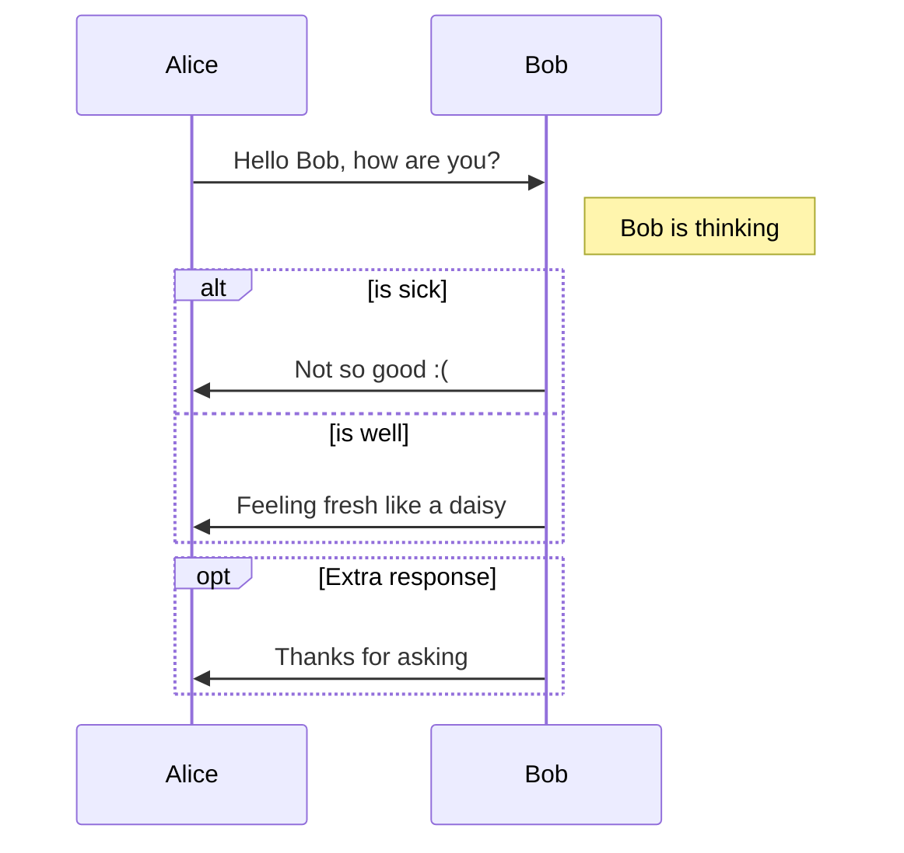

# hogehoge

## hogehoge 

### hogehoeg

- hogehoge
- hogehoge

1. hogehoge
2. hogehoge

- [ ] hogehoge

```md
hogehoge
```

*hogehoeg*

**hogehoge**

~~hogehoeg~~

|hoge|hoge|
|---|---|
|hoge|hoge

[hogehoge](hogehoge)

```python
print("hogehoge")

print(1 + 2)
```


> [!NOTE]
> This is a NOTE

> [!WARNING]
> This is a WARNING

> [!ERROR]
> This is a ERROR

> [!TIP]
> This is a TIP

> [!IMPORTANT]
> This is IMPORTANT


```latex
\{\frac{4}{5}, \sqrt{49},
\, 6, \overline{3}, \, 7\sqrt{5}
\}
```



